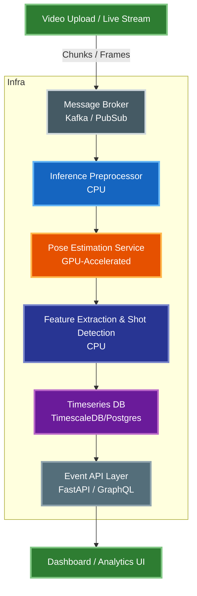

# Shot Attempt Detection Challenge

**Author:** Pedro Andrade Vieira  
**Date:** October 27th 2025  
**Kinexon Coding Challenge Submission**

---

## Overview

This project implements a **machine learning approach for detecting shot attempts in basketball games** using time-series data of player positions and skeleton keypoints.

The solution includes:
1. **Feature engineering pipeline** extracting basketball-specific features from player data
2. **Random Forest classifier** trained on labeled shot events with temporal train/test split
3. **Comprehensive evaluation framework** with temporal matching and visualization
4. **Proposed cloud architecture** for scaling shot detection from raw video streams

The approach demonstrates a **reasonable, explainable, and extensible ML solution** using established computer vision and machine learning techniques.

---

## Repository Structure

```
.
├── data/
│   ├── detections.csv           # Skeleton keypoint detections
│   ├── player_positions.csv     # Player X,Y coordinates
│   └── shot_events.json         # Ground truth shot events
│
├── src/
│   ├── exploratory_data_analysis.py    # EDA plotting and visualization
│   ├── preprocess.py                   # Data loading & normalization
│   ├── features.py                     # Feature extraction from keypoints
│   ├── detect_shots.py                 # Random Forest training & detection
│   ├── evaluate.py                     # Evaluation metrics & visualization
│   └── fake_results.py                 # Testing utility for evaluation
│
├── models/
│   └── shot_detector.pkl        # Trained Random Forest model (after train)
│
├── output/
│   └── predicted_shots.csv      # Detection results (after prediction)
│
├── plots/
│   ├── [multiple PNG images]                # Data analysis visualization (after eda)
│   └── evaluation_temporal_alignment.png    # Evaluation visualization (after evaluation)
│
├── .gitignore                   # Files/directories ignored by GIT
├── pyproject.toml               # Poetry dependencies
├── poetry.lock                  # Poetry lock file
└── README.md
```

---

## Setup & Usage

### 1. Environment
```bash
git clone https://github.com/pedroacvieira/ShotAttemptDetection.git
cd shot-attempt-detection
poetry install
```

### 2. Exploratory Data Analysis (Optional)
```bash
# View data distribution and visualizations
poetry run eda
```

### 3. Train Model
```bash
# Train Random Forest classifier with default parameters
poetry run detection train

# Or with custom parameters
poetry run detection train --rolling-window-ms 1200 --n-estimators 100 --max-depth 20
```

### 4. Run Detection
```bash
# Detect shots using trained model
poetry run detection detect

# Or with custom confidence threshold
poetry run detection detect --confidence-threshold 0.6 --min-gap-ms 1000
```

### 5. Evaluate Results
```bash
# Evaluate predictions against ground truth
poetry run evaluate

# Or with custom parameters
poetry run evaluate --tolerance-ms 500 --match-player-id --verbose
```

### 6. View Model Information
```bash
# Display model parameters and feature importance
poetry run detection info
```

---

## Approach

### 1. Data Understanding

The provided data sources:
- **`detections.csv`** — bounding boxes and skeleton keypoints (normalized)
- **`player_positions.csv`** — player coordinates and motion data
- **`shot_events.json`** — ground-truth shot attempts with:
  - `timestamp_s` and `end_timestamp_s`: Start and end of each shot event
  - `player_id`: Player who attempted the shot

All data are synchronized on timestamp (ms).

#### Assumptions
- Shot attempts exhibit characteristic motion patterns detectable from skeletal keypoints
- Hand elevation, body stability, and temporal dynamics are predictive features
- Each `player_id` in the data corresponds to a single tracked player throughout the game
- All timestamps are synchronized across detection and position data sources
- Ground truth shot events span time ranges (timestamp_s to end_timestamp_s)
- Shot attempts are relatively rare events (class imbalance addressed via weighting)

---

### 2. Feature Engineering

The `features.py` module extracts basketball-specific features from skeletal keypoint data. All features are computed per-player to avoid cross-player contamination in time-series calculations.

**Hand Movement Features:**
- **Hand Y relative to head**: Vertical distance of each hand from face position (higher values = hands raised above head)
- **Hand Y velocity relative to head**: Rate of change in vertical hand position relative to head (captures upward/downward motion)
- **Hand distance**: Euclidean distance between left and right hands (wider separation common in shooting motions)

**Body Position Features:**
- **Heel distance**: Distance between heels normalized by bounding box height (wider stance during shooting preparation)
- **Hand Y to bbox**: Hand positions relative to bounding box, normalized (0 = top of bbox)
- **Hip Y to bbox**: Hip position relative to bounding box, normalized (tracks body center-of-mass)
- **Hand-hip ratio**: Ratio of hand position to hip position (values > 1 indicate hands above hips)

**Motion Features:**
- **Hip speed to bbox**: Vertical hip movement rate normalized by bounding box height (captures body motion dynamics)
- **Player absolute speed**: Euclidean speed from X,Y position data (meters per second)

**Temporal Features:**
- **Rolling maximum**: Maximum values over configurable time windows (default: 500ms-1200ms depending on context)
  - Applied to key features to capture temporal dynamics and peak movements
  - Helps detect the characteristic motion patterns of shooting attempts

**Data Smoothing:**
- **Savitzky-Golay filter** (window=9, polynomial=2) applied to positional features to reduce noise
- Applied per-player before calculating velocity and speed features

All features are merged with original timestamp_ms preserved for evaluation against ground truth.

---

### 3. Training and Detection

The `detect_shots.py` module implements a **Random Forest classifier** for shot attempt detection with a complete training and inference pipeline.

#### Training Pipeline

1. **Feature Extraction:**
   - Extract all features using configurable rolling window (default: 1200ms)
   - Features include hand positions, velocities, body posture, and temporal dynamics

2. **Label Creation:**
   - Binary labels (0=no shot, 1=shot) created from ground truth shot events
   - Frames within shot event time range (`timestamp_s` to `end_timestamp_s`) labeled as shots
   - Labels aligned with feature window center for temporal consistency
   - Optional offset parameter to compensate for early/late model firing

3. **Temporal Train/Test Split:**
   - Uses `TimeSeriesSplit` from scikit-learn to ensure temporal ordering
   - Test data comes chronologically after training data (realistic evaluation)
   - Prevents information leakage from future data

4. **Model Training:**
   - Random Forest classifier with configurable parameters (default: 100 estimators)
   - Class-weighted training to handle class imbalance (shots are rare events)
   - Feature importance analysis to identify most predictive features

5. **Evaluation:**
   - Precision, Recall, F1-Score on test set
   - Confusion matrix and classification report
   - Top-10 most important features displayed

#### Detection Pipeline

1. **Load Trained Model:**
   - Model includes feature definitions and rolling window parameters
   - Ensures consistency between training and inference

2. **Feature Extraction:**
   - Same feature extraction pipeline applied to new data
   - Uses stored rolling window size from training

3. **Prediction:**
   - Configurable confidence threshold (default: 0.5)
   - Returns probability scores for each frame

4. **Temporal Grouping:**
   - Groups nearby predictions within minimum gap (default: 1000ms)
   - Uses median timestamp_ms of grouped frames as final shot time
   - Reduces duplicate detections from consecutive frames

**Output format:**
```csv
timestamp_ms,player_id
1754951121502,3
1754950807722,0
1754950868262,4
```

---

### 4. Evaluation

The `evaluate.py` module provides comprehensive evaluation of predictions against ground truth shot events using temporal matching with configurable tolerance.

#### Evaluation Methodology

1. **Temporal Matching with Shot Event Ranges:**
   - Ground truth shot events span time ranges from `timestamp_s` to `end_timestamp_s`
   - Predictions matched if they fall within the shot event time range: `[start - tolerance, end + tolerance]`
   - Tolerance buffer (default: ±500ms) extends the acceptable range on both sides
   - Each prediction matched to the closest unmatched ground truth event (by midpoint distance)
   - Prevents multiple predictions from matching the same ground truth event

2. **Player ID Matching (Optional):**
   - Can require player IDs to match in addition to timestamps
   - Handles "Undefined" player IDs gracefully
   - Configurable via `--match-player-id` flag

3. **Metrics Calculation:**
   - **True Positives**: Predictions within tolerance of ground truth
   - **False Positives**: Predictions with no matching ground truth
   - **False Negatives**: Ground truth events with no matching prediction
   - **Precision**: TP / (TP + FP) - accuracy of predictions
   - **Recall**: TP / (TP + FN) - coverage of ground truth events
   - **F1-Score**: Harmonic mean of precision and recall

#### Visualization

Two plots generated (saved to `plots/evaluation_temporal_alignment.png`):

1. **Temporal Alignment Timeline:**
   - Ground truth shot events shown as **horizontal bars** spanning their duration (start to end)
   - Matched events in green, missed events in red
   - Predictions shown as points (true positives in green, false positives in orange)
   - Time axis in minutes for easy interpretation
   - Clearly visualizes whether predictions fall within shot event windows

2. **Time Difference Distribution:**
   - Histogram of time differences: Prediction - Shot Event Midpoint
   - Shot event midpoint = (timestamp_s + end_timestamp_s) / 2
   - Red dashed line at x=0 indicates perfect alignment with midpoint
   - Green shaded region shows average shot event duration
   - Shows temporal bias (early/late predictions relative to shot center)
   - Only includes matched events

#### Output

Detailed console output includes:
- Dataset summary (number of events, tolerance used)
- Matching results (TP, FP, FN counts)
- Performance metrics (precision, recall, F1-score as percentages)
- Optional verbose mode for per-event analysis

---

## System Design Proposal

### Goal
Design a **cloud-based architecture** to automatically detect shot attempts from **video streams** at scale.

---

### High-Level Architecture



---

### Scalability & Deployment

The system is designed to scale along two primary axes: **number of concurrent video streams** and **inference throughput** (FPS). All processing stages are loosely coupled to prevent cascading failures.

| Component                               | Technology | Notes |
|-----------------------------------------|-------------|-------|
| **Video storage**                       | AWS S3 / GCP Cloud Storage | Durable storage for raw input; triggers downstream processing |
| **Video ingestion**                     | Kafka / PubSub | Buffers frames and decouples producers from consumers, prevents backpressure |
| **Pose estimation**                     | GPU-backed Kubernetes pods | Horizontally autoscaled based on queue lag; GPU-resource optimized |
| **Feature extraction & shot detection** | CPU-backed pods | Stateless microservices, autoscaled separately from pose inference |
| **Time-series data store**              | TimescaleDB / Postgres | Efficient storage and querying of temporal shot events |
| **Model registry (optional)**           | MLflow / S3 | Versioning and rollout of updated detection models |
| **Monitoring**                          | Prometheus + Grafana | Tracks queue lag, inference latency, GPU utilization |
| **API layer**                           | FastAPI / Flask | Serves detected shot attempts to downstream apps (dashboards, analytics) |

#### Scaling strategy
- **Horizontal scaling** of inference workers based on Kafka topic lag
- **Independent scaling** of pose and shot detection services
- **Stateless processors** — easy redeploys & rollouts
- **Cloud object storage** — cheap & highly available

#### Resilience
- Message queues absorb spikes during peak load
- Failed frames are retried without blocking upstream
- Graceful degradation if GPU capacity is saturated

---

## Future Improvements

### Data Quality & Collection
- **Expand dataset**: Currently only 2 players have significant shot attempt data
  - Use data from different games/practices for train and evaluation
  - Collect data from more players across multiple games for better generalization
  - Address class imbalance with more diverse shot examples
  - Include different game scenarios (practice vs. competitive, various venues)
- **Data cleaning**: Implement outlier detection and noise filtering for skeletal keypoints
- **Data augmentation**: Apply temporal perturbations and synthetic data generation
- **Real 3D Data**: Obtain 3D player position in the court coordinate system

### Feature Engineering
- **Feature selection**: Use techniques like RFECV, mutual information, or SHAP values to identify minimal effective feature set
- **New features**: Experiment with:
  - Joint angles and angular velocities (if possible with the current 8-point skeleton)
  - Ball-hand proximity features
  - Player-basket orientation and distance
  - Compare player position with common shot positions (consider player team and court side)
- **Feature importance analysis**: Per-player feature importance to understand individual playing styles

### Model Training & Architecture
- **Hyperparameter optimization**: Systematic tuning using GridSearchCV, RandomizedSearchCV, or Bayesian optimization (Optuna)
- **Alternative models**:
  - Gradient Boosting (XGBoost, LightGBM, CatBoost)
  - Deep learning: LSTM, GRU, Temporal Convolutional Networks (TCN), Transformers
  - Ensemble methods combining multiple model types
- **Per-player models**: Train specialized models for each player to capture individual shooting patterns
  - Possibly also use different models for practice and games
- **Transfer learning**: Pre-train on large dataset, fine-tune on individual players

### Evaluation & Validation
- **Cross-validation**: Implement time-series cross-validation across multiple games
- **Per-player evaluation**: Analyze performance separately for each player to identify weaknesses
- **Stratified splits**: Ensure balanced representation of players in train/test splits
- **External validation**: Test on completely unseen games and venues

### System Extensions
- **Multi-view camera integration**: Use 3D pose estimation from multiple camera angles
- **Real-time inference**: Optimize for low-latency streaming detection
- **Shot type classification**: Extend to multi-class problem (3-pointer, layup, dunk, free throw)
- **Confidence scores**: Add calibrated uncertainty estimates for each prediction
- **Online learning**: Adapt model during games for player-specific patterns and data drift

---

## Contact
If you have any questions or would like to discuss the approach, feel free to reach out during the interview.
